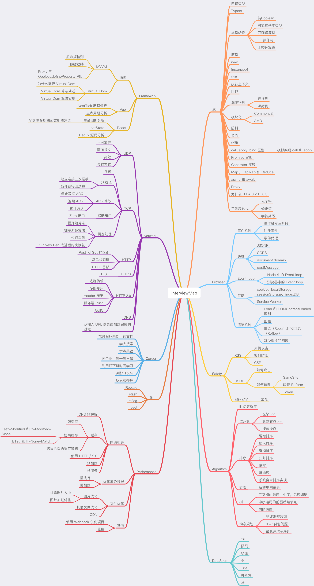

# 面试

> [职业发展路径](https://github.com/f2e-journey/f2e-journey/blob/master/career-planning.md)

## 方向

简历
1、简历至少两页
2、突出重点，引导面试官
3、项目要有亮点

前端技术准备
1、HTML/CSS/JS
2、框架React和Vue及其周边
3、前端工具Webpack和Babel

HTML&CSS
1、HTML新标签， 语义化
2、BFC和移动端适配

jS
1、es6 熟练使用
2、常见的前端概念，防抖节流，作用域链，闭包，柯里化等等
3、跨域的解决方案 JSONP至少能口述出来

React

1、setState更新原理，必须彻底理解
2、事件机制了解
3、Fiber了解
4、Redux精通


Webpack&Babel
1、Webpack打包原理和热更新原理了解
2、Loader和Plugins区别，熟悉，最好自己动手写几个
3、Babel原理 AST熟悉

网络
1、输入URL到页面展现
2、Http三次握手和四次挥手过程 熟练
3、Https 熟练
4、cookie 重点必会

数据结构&算法&设计模式
1、链表和二叉树的遍历 熟悉
2、常见排序算法 熟悉
3、发布订阅模式，必会

4 express 中间件和洋葱模型

5.算法

6.网页优化


1. 综合软实力

-   逻辑思维
-   沟通表达能力，是否理解面试官的问题，并清楚应对
-   对自己现状能力有清醒的认知，清楚自己要的是什么，并曾为此付诸行动
-   抗压能力
-   对当前负责的业务理解力

3. 行业相关性

-   是否之前有相关技术沉淀，如博客文章、开源项目等
-   具备相关目标团队类似经验，如工程化、Node.js 应用、数据可视化加分

4. 工作经验 & 个人认知

-   稳定性 OR 丰富程序
-   稳定性需要考虑是否有成长，有定力
-   丰富程度多的简历，需要考核的是每次更换工作的合理性，是否和自己专业发展的匹配


## 

## 流程


1.  [计算机基础知识](https://github.com/CyC2018/Interview-Notebook)


## 复习过程

1. 阅读[前端开发面试题](https://juejin.im/entry/5781b8db0a2b58005765e628) HTML CSS
2. [css](./content/css.md)
3. [移动端](./content/mobile/base.md)

4. [js 基础知识](./content/notebook/jsbase.md)
    - [promise 实现](./content/notebook/01_async.md)
5. http
    - [http 基础](./content/net/http/cacheHttp.md)
    - [http 题目](./content/net/http/httpques.md)
    * [HTTP 返回码中 301 与 302 的区别](https://blog.csdn.net/qmhball/article/details/7838989)
    * [HTTP/1 的缺点总结](https://segmentfault.com/a/1190000013519925)
    * [HTTP2.0 特性](https://blog.csdn.net/qq_32337109/article/details/79975253)
    * [解决跨域](https://github.com/hijiangtao/hijiangtao.github.io/blob/master/_posts/2017-06-13-Cross-Origin-Resource-Sharing-Solutions.md)
    *  cookie 
      1. document.cookie = cname + "=" + cvalue + "; " + expires+"; path=/"   访问cookie
    * DNS 解析过程[https://www.cnblogs.com/liyuanhong/articles/7353974.html]

7. [专题系列目录](https://github.com/mqyqingfeng/Blog)

---

1.  node
4.  react hook
5.  redux
7.  [react 性能优化](https://juejin.im/post/5b506ae0e51d45191a0d4ec9)
8.  项目准备
    1. aouth 授权
    2. [jwt](https://mp.weixin.qq.com/s/osSlrEgk0uhOoicAH3IGOw)
    3. [前后端分离中的无痛刷新 token 机制](https://www.jianshu.com/p/58f05bf13b7d)
    4. 浏览器渲染原理
13. webworker
14. 各种手写函数（promise 实现原理）

## 面试点：

-   [2019 前端面试题--这样准备，拿不到 offer 算我输！](https://juejin.im/post/5cbff661e51d456e693f48ec)
-   [中高级前端大厂面试秘籍，为你保驾护航金三银四，直通大厂(上)](https://juejin.im/post/5c64d15d6fb9a049d37f9c20#heading-71)
-   [(中篇)中高级前端大厂面试秘籍，寒冬中为您保驾护航，直通大厂](https://juejin.im/post/5c92f499f265da612647b754?utm_source=gold_browser_extension)
-   [「中高级前端面试」JavaScript 手写代码无敌秘籍](https://mp.weixin.qq.com/s/v3Jb_dDBdX1-Y090v-xxwg)
-   [每个 JavaScript 工程师都应懂的 33 个概念 @leonardomso](https://github.com/stephentian/33-js-concepts)
-   [Promise 与 Async/await 来控制异步和超时问题](https://www.yuque.com/giscafer/felearn/agt7re)
-   [深入 Promise 错误处理](https://juejin.im/post/59dae4b05188252e7547a552)
-   [你可能不知道的 6 件事](https://github.com/dwqs/blog/issues/1)
-   [前端面试题链接](https://github.com/qiu-deqing/FE-interview)
-   [面试题目](https://github.com/chenjinxinlove/javascriptInterview)
-   [木容杨](https://github.com/Advanced-Frontend/Daily-Interview-Question/blob/master/datum/summary.md)
-   [阿里](https://juejin.im/post/5d690c726fb9a06b155dd40d?utm_source=gold_browser_extension)
-   [耗时 6 小时的同花顺面试](https://juejin.im/post/5c89b19fe51d45319629382c)
-   [记一次腾讯社招前端面试](https://mp.weixin.qq.com/s/U9-f_sA651UwSbksdHg_aw)
    面试的时候尽量体现你的广度和深度，比如浏览器的兼容性来说，先把这块知识体系罗列出来，考察广度。
-   [头条面经](https://mp.weixin.qq.com/s/JtdWPnRYxNKawXJm5HeW0w)
-   [react](https://mp.weixin.qq.com/s/5Fe5pHjjJB5EFKvW0Mv7gg)
-   [手写](https://mp.weixin.qq.com/s/v3Jb_dDBdX1-Y090v-xxwg)
-   [字节跳动今日头条前端面经（4轮技术面+hr面）](https://juejin.im/post/5e6a14b1f265da572978a1d3?utm_source=gold_browser_extension)
-   [深入理解 Node.js 进程与线程](https://mp.weixin.qq.com/s/VzXnnfn4gCBMd5wea3LRIg)
-   [一位前端小姐姐的五万字面试宝典](https://juejin.im/post/5e91b01651882573716a9b23)
-   [一年半前端跳槽面试经验（](https://juejin.im/post/5e70f5d351882549453882f6?utm_source=gold_browser_extension)
-   [实战](https://juejin.im/post/5e61c161518825493e5353d1)
-   [不知名本科菜鸡の春招前端心路历程（阿里，腾讯，美团） | 掘金技术征文](https://juejin.im/post/5e88458df265da4800039ed5)
-   [百度 WEB前端工程师 连续五面 全程3约个小时](https://www.jianshu.com/p/3433142faa68)
-   [写给女朋友的中级前端面试秘籍（含详细答案，15k级别](https://juejin.im/post/5e7af0685188255dcf4a497e)
- [新鲜出炉的头条面经(已拿offer)](https://mp.weixin.qq.com/s/JtdWPnRYxNKawXJm5HeW0w)
- [阿里社招面经（已过）](https://mp.weixin.qq.com/s/_Gj8l56ow6pyWuJV7iuxMg)
- [【面试题】 阿里 P6 的面经](https://mp.weixin.qq.com/s/SaxRSgOPCE0DNEpe9ugGQQ)
- [美团点评 - 到店事业群 前端面经（3轮技术面+hr面）](https://juejin.im/post/5e85b6c46fb9a03c37302e1f)
- [艺术喵 2 年前端面试心路历程（字节跳动、YY、虎牙、BIGO）| 掘金技术征文](https://juejin.im/post/5e85ec79e51d4547153d0738)
- [非科班二本前端大厂面试的心路历程和总结（腾讯、头条、阿里、京东） | 掘金技术征文](https://juejin.im/post/5e818e4de51d4546fb276d97)
## 优化

1. 什么是无头浏览器 他的作用是啥
2. https 抓包原理是什么 如何抓包
3. 重绘和回流是渲染步骤中的一小节，但是这两个步骤对于性能影响很大。
    1. 重绘是当节点需要更改外观而不会影响布局的，比如改变  color  就叫称为重绘
    2. 回流是布局或者几何属性需要改变就称为回流。

回流必定会发生重绘，重绘不一定会引发回流。回流所需的成本比重绘高的多，改变深层次的节点很可能导致父节点的一系列回流。
所以以下几个动作可能会导致性能问题：

-   改变 window 大小
-   改变字体
-   添加或删除样式
-   文字改变
-   定位或者浮动
-   盒模型

很多人不知道的是，重绘和回流其实和 Event loop 有关。

-   当 Event loop 执行完 Microtasks 后，会判断 document 是否需要更新。因为浏览器是 60Hz 的刷新率，每 16ms 才会更新一次。
-   然后判断是否有  resize  或者  scroll ，有的话会去触发事件，所以  resize  和  scroll  事件也是至少 16ms 才会触发一次，并且自带节流功能。
-   判断是否触发了 media query
-   更新动画并且发送事件
-   判断是否有全屏操作事件
-   执行  requestAnimationFrame  回调
-   执行  IntersectionObserver  回调，该方法用于判断元素是否可见，可以用于懒加载上，但是兼容性不好
-   更新界面
-   以上就是一帧中可能会做的事情。如果在一帧中有空闲时间，就会去执行  requestIdleCallback  回调。
    少重绘和回流
    使用  translate  替代  top

<div class="test"></div>
<style>
	.test {
		position: absolute;
		top: 10px;
		width: 100px;
		height: 100px;
		/* background: red; */
	}
</style>
<script>
	setTimeout(() => {
        // 引起回流
		document.querySelector('.test').style.top = '100px'
	}, 1000)
</script>

-   不要使用 table 布局，可能很小的一个小改动会造成整个 table 的重新布局
-   动画实现的速度的选择，动画速度越快，回流次数越多，也可以选择使用  requestAnimationFrame
-   CSS 选择符从右往左匹配查找，避免 DOM 深度过深
-   将频繁运行的动画变为图层，图层能够阻止该节点回流影响别的元素。比如对于  video  标签，浏览器会自动将该节点变为图层。

1. 今日面试题

    1. 什么是重绘（Repaint）和回流（Reflow）？
    2. 哪些动作可能会导致重绘（Repaint）和回流（Reflow）的发生？
    3. 重绘（Repaint）和回流（Reflow）和 Event loop 的关系？
    4. 如何减少重绘（Repaint）和回流（Reflow）？

2. 请说说浏览器事件机制中事件触发三个阶段
   事件触发三阶段
   事件触发有三个阶段
   document  往事件触发处传播，遇到注册的捕获事件会触发
   传播到事件触发处时触发注册的事件
   从事件触发处往  document  传播，遇到注册的冒泡事件会触发
   事件触发一般来说会按照上面的顺序进行，但是也有特例，如果给一个目标节点同时注册冒泡和捕获事件，事件触发会按照注册的顺序执行。

// 以下会先打印冒泡然后是捕获
node.addEventListener('click',(event) =>{
console.log('冒泡')
},false);
node.addEventListener('click',(event) =>{
console.log('捕获 ')
},true)

注册事件
通常我们使用  addEventListener  注册事件，该函数的第三个参数可以是布尔值，也可以是对象。对于布尔值  useCapture  参数来说，该参数默认值为  false 。useCapture  决定了注册的事件是捕获事件还是冒泡事件。对于对象参数来说，可以使用以下几个属性
capture，布尔值，和  useCapture  作用一样
once，布尔值，值为  true  表示该回调只会调用一次，调用后会移除监听
passive，布尔值，表示永远不会调用  preventDefault
一般来说，我们只希望事件只触发在目标上，这时候可以使用  stopPropagation  来阻止事件的进一步传播。通常我们认为  stopPropagation  是用来阻止事件冒泡的，其实该函数也可以阻止捕获事件。stopImmediatePropagation  同样也能实现阻止事件，但是还能阻止该事件目标执行别的注册事件。

node.addEventListener('click',(event) =>{
event.stopImmediatePropagation()
console.log('冒泡')
},false);
// 点击 node 只会执行上面的函数，该函数不会执行
node.addEventListener('click',(event) => {
console.log('捕获 ')
},true)

事件代理
如果一个节点中的子节点是动态生成的，那么子节点需要注册事件的话应该注册在父节点上

<ul id="ul">
	<li>1</li>
    <li>2</li>
	<li>3</li>
	<li>4</li>
	<li>5</li>
</ul>
<script>
	let ul = document.querySelector('##ul')
	ul.addEventListener('click', (event) => {
		console.log(event.target);
	})
</script>

7 请说说在 hybrid 端实现类似原生版流畅的体验要注意的事情

8.如果发现在某个用户的电脑上，网站的静态资源打不开了，如何确定是 CDN 的问题还是那个用户机器、浏览器的问题？

9.crsf 冲击是什么 如何防范

CSRF
跨站请求伪造（英语：Cross-site request forgery），也被称为  one-click attack 或者  session riding，通常缩写为  CSRF  或者  XSRF， 是一种挟制用户在当前已登录的 Web 应用程序上执行非本意的操作的攻击方法。[1]  跟跨網站指令碼（XSS）相比，XSS  利用的是用户对指定网站的信任，CSRF 利用的是网站对用户网页浏览器的信任。
简单点说，CSRF 就是利用用户的登录态发起恶意请求。
如果接口是 Post 提交的，就相对麻烦点，需要用表单来提交接口

如何防御
防范 CSRF 可以遵循以下几种规则：
Get 请求不对数据进行修改
不让第三方网站访问到用户 Cookie
阻止第三方网站请求接口
请求时附带验证信息，比如验证码或者 token
#SameSite
可以对 Cookie 设置  SameSite  属性。该属性设置 Cookie 不随着跨域请求发送，该属性可以很大程度减少 CSRF 的攻击，但是该属性目前并不是所有浏览器都兼容。 #验证 Referer
对于需要防范 CSRF 的请求，我们可以通过验证 Referer 来判断该请求是否为第三方网站发起的。
#Token
服务器下发一个随机 Token（算法不能复杂），每次发起请求时将 Token 携带上，服务器验证 Token 是否有效。

10 xss 是什么如何攻击 如何防御

XSS
跨网站指令码（英语：Cross-site scripting，通常简称为：XSS）是一种网站应用程式的安全漏洞攻击，是代码注入的一种。它允许恶意使用者将程式码注入到网页上，其他使用者在观看网页时就会受到影响。这类攻击通常包含了 HTML 以及使用者端脚本语言。
XSS 分为三种：反射型，存储型和 DOM-based
我的手机 12:34:21
如何攻击
XSS 通过修改 HTML 节点或者执行 JS 代码来攻击网站。
例如通过 URL 获取某些参数

上述 URL 输入可能会将 HTML 改为  <div><script>alert(1)</script></div> ，这样页面中就凭空多了一段可执行脚本。这种攻击类型是反射型攻击，也可以说是 DOM-based 攻击。
也有另一种场景，比如写了一篇包含攻击代码  <script>alert(1)</script>  的文章，那么可能浏览文章的用户都会被攻击到。这种攻击类型是存储型攻击，也可以说是 DOM-based 攻击，并且这种攻击打击面更广。
以上示例使用了  js-xss  来实现。可以看到在输出中保留了  h1  标签且过滤了  script  标签

对于显示富文本来说，不能通过上面的办法来转义所有字符，因为这样会把需要的格式也过滤掉。这种情况通常采用白名单过滤的办法，当然也可以通过黑名单过滤，但是考虑到需要过滤的标签和标签属性实在太多，更加推荐使用白名单的方式。

只允许加载 HTTPS 协议图片

https://content-security-policy.com/
https://eggjs.org/zh-cn/core/security.html

防抖
你是否在日常开发中遇到一个问题，在滚动事件中需要做个复杂计算或者实现一个按钮的防二次点击操作。
这些需求都可以通过函数防抖动来实现。尤其是第一个需求，如果在频繁的事件回调中做复杂计算，很有可能导致页面卡顿，不如将多次计算合并为一次计算，只在一个精确点做操作。因为防抖动的轮子很多，这里也不重新自己造个轮子了，直接使用 underscore 的源码来解释防抖动。
我的手机 12:37:25
整体函数实现的不难，总结一下。
对于按钮防点击来说的实现：一旦我开始一个定时器，只要我定时器还在，不管你怎么点击都不会执行回调函数。一旦定时器结束并设置为  null，就可以再次点击了。
对于延时执行函数来说的实现：每次调用防抖动函数都会判断本次调用和之前的时间间隔，如果小于需要的时间间隔，就会重新创建一个定时器，并且定时器的延时为设定时间减去之前的时间间隔。一旦时间到了，就会执行相应的回调函数。

12.一个单页面应用，有 6 张页面，F、E、A、B、C、D。 页面 ABCD 构成了一个冗长的用户验证过程。目前 A、B、C 对应用户验证过程的第 1 步，第 2 步，第 3 步。 页面 F 是首页，E 是某张业务相关页面。用户到达页面 E 后，系统发现用户没有认证，触发验证流程，到达页面 A，然后开始 A->B->C->D 流程。 页面 D 是验证结果页面（验证成功页面）。 请问，如果到达页面 D 后，如何让用户点击返回可以返回页面 F，而忽略中间流程（注：用户可能根本没有到达过 F，比如微信分享直接进入了 E）。
补充下： 场景是上述场景，最好能做到到达页面 D 后，浏览器自然返回是 F，再按返回，单页面系统退出；另外请思考下各个流程如何实现流畅切换，不会有中间闪烁的页面。

这个问题初一看是对单页面路由架构的考察。也是一个很好的引入问题，可以考察非常多方面。 比如说：如何实现页面切换动画？ A、B、C 都是表单的话，如何缓存用户输入完成的表单数据？……回到问题，因为 history api 提供了 push/pop/replace 三种操作，无论是其中的任何一种都无法实现上述的效果。 一个路由系统，首先要监听浏览器地址的变化，然后根据变化渲染不同的页面。1. 在页面到达 D 后，关闭对路由变化页面渲染的监听。 2. 路由系统要进行多次 POP，可以用 history.go(-n)实现； 3. 路由栈清空到只剩下一张页面时，将这张页面替换为 F。 4. PUSH 一张页面 D。 5. 如果在 HTML 上有一个类似「轮播图」的设计，就是每一张页面是一张轮播图，将轮播图设置成只有「F」和「D」。 5. 恢复路由监听。 这个问题的另一个考点是，在上述完整的计算过程当中，需要知道当前历史记录中的页面数，页面数可以通过 localStorage 实现，在 ls 中维护一个变量，每次 push 的时候+1，并写入 history.state。 POP 的时候读取 history.state 将变量重置。

18 如何计较两个颜色的相似度

今天题目参考答案
这是一道开放题目，首先将颜色拆分成 r/g/b 三个值，如果是字符串的颜色如#aabbff 或者 rgb(255,128,100)可以用正则表达式取出对应的 r/g/b 值。对于 16 进制字符串，可以使用 parseInt('0xaa')转 10 进制整数。然后对于两个颜色，可以使用距离 Math.sqrt( (r1-r2) _(r1-r2) +(g1-g2)_(g1-g2)+(b1-b2)\*(b1-b2) )进行比较， 距离近则相似。 当然可以用 Math.hypot( r1-r2, g1-t2, b1-b2) 来简化上述运算。
这道题目主要考察学员的知识积累和思考。 首先要知道 rgb 是颜色的组成。 然后要给出一种可行的比较方法。 最后要考察具体 javascript 细节函数的运用。

# js 基本题目

> 参考资料
> [](<https://github.com/forrany/Web-Project/blob/master/%E4%BA%8C%E3%80%81JavaScript%E6%8E%92%E5%9D%91%E6%8C%87%E5%8D%97(%E4%BA%8C).md>)

1. js 堆栈溢出
   [Javascript 中递归造成的堆栈溢出及解决方案](http://www.zuojj.com/archives/1115.html)
   下面的代码会造成堆栈溢出，怎么优化

```
function isEven (num) {
    if (num === 0) {
        return true;
    }

    if (num === 1) {
        return false;
    }

    return isEven(Math.abs(num) - 2);
}

//Outputs: true
console.log(isEven(10));

//Outputs: false
console.log(isEven(9));

```

首先搞清楚，堆栈溢出的原因。
每次在执行代码时候都会分配一定尺寸的栈空间，每次方法调用的时候都会在栈里存储一定信息（如参数，局部变量，返回值等等），这些信息再少也会占用一定的空间，成千上万个此类空间积累起来，自然就超过线程的栈空间了。
解决这个问题有两个思路：

-   异步
-   闭包

```
var  list  = readHugList();
var nextListItem = function(){
    var item = list.pop();
    if(item){
       setTimeout(nextListItem,0}
    }
}
```

**为什么使用 setTimeout 就可以解决问题？我们看下与没用之前的差别。如果没有使用 setTimeout，那么函数将在大数据前不断的回调，直到最后走到重点，最初的函数才运行结束，释放内存。 但是如果使用了 setTimeout，我们知道它是异步的，即使设置了时间为 0，它也允许先执行下面的内容，可以释放堆栈，从而避免堆栈溢出的问题。 换言之，加了 setTimeout，nextListItem 函数被压入事件队列，函数可以退出，因此每次会清空调用堆栈。**

-   闭包

```
function isEven (num) {
    if (num === 0) {
        return true;
    }

    if (num === 1) {
        return false;
    }

    return function() {
        return isEven(Math.abs(num) - 2);
    }
}
//Outputs: true
console.log(isEven(4)()());
```

```
优化
function isEven (num) {
    if (num === 0) {
        return true;
    }

    if (num === 1) {
        return false;
    }

    return function() {
        return isEven(Math.abs(num) - 2);
    }
}

function trampoline (func, arg) {
    var value = func(arg);

    while(typeof value === "function") {
        value = value();
    }

    return value;
}
//Outputs: true
console.log(trampoline(isEven, 10000));

//Outputs: false
console.log(trampoline(isEven, 10001));
```

```
再次优化
function isEven(n) {
    /**
     * [isEvenInner 递归]
     * @param  {[type]}  num [description]
     * @return {Boolean}     [description]
     */
    function isEvenInner (n) {
        if (n === 0) {
            return true;
        }

        if (n === 1) {
            return false;
        }

        return function() {
            return isEvenInner(Math.abs(n) - 2);
        }
    }
    /**
     * [trampoline 迭代]
     * @param  {[type]} func [description]
     * @param  {[type]} arg  [description]
     * @return {[type]}      [description]
     */
    function trampoline (func, arg) {
        var value = func(arg);

        while(typeof value === "function") {
            value = value();
        }

        return value;
    }

    return trampoline.bind(null, isEvenInner)(n);
}
//Outputs: true
console.log(isEven(10000));

//Outputs: false
console.log(isEven(10001));
```

2.  object key 的属性

下面函数输出是什么

```
var a={},
    b={key:'b'},
    c={key:'c'};

a[b]=123;
a[c]=456;
console.log(a[b]);// 456

```

如果了解了 es6 的 map 就会意识到，对象 key 的值只允许 string 类型的，这也是为什么会引入 map 数据类型。 好了，那如果把一个对象作为 key 值，就会调用 toString 方法了。Object.prototype.toString(obj)会得到什么呢？没错`[object Object]。

```
a[b] ==> a["[object Object"] = 123;
a[b] ==> a["[object Object"] = 456;
```

3. 变量提升

(function () {
console.log(x)
try {
throw new Error();
} catch (x) {
var x = 1, y = 2;
console.log(x);
}
console.log(x);
console.log(y);
})();

(function () {
var x,y; // 外部变量提升
try {
throw new Error();
} catch (x/_ 内部的 x _/) {
x = 1; //内部的 x，和上面声明的 x 不是一回事！！
y = 2; //内部没有声明，作用域链向上找，外面的 y
console.log(x); //当然是 1
}
console.log(x); //只声明，未赋值，undefined
console.log(y); //就是 2 了
})();

4. 递归设计。 实现一个函数，给该函数一个 DOM 节点，函数访问其所有子元素(所有子元素，不仅仅是直接子元素)，每次访问子元素的时候，并为其传一个 callback。

```
function Traverse(DOM, callback){
    callback(DOM)
    var list = DOM.children;
    Array.prototype.forEach.apply(list,(item)=>{
        Traverse(item,callback);
    })
}
```

5. 用 setTimeout 来实现 setInterval
   [](https://juejin.im/post/5b44a485e51d4519945fb6b7)

(1)用 setTimeout()方法来模拟 setInterval()与 setInterval()之间的什么区别？
首先来看 setInterval 的缺陷，使用 setInterval()创建的定时器确保了定时器代码规则地插入队列中。这个问题在于：如果定时器代码在代码再次添加到队列之前还没完成执行，结果就会导致定时器代码连续运行好几次。而之间没有间隔。不过幸运的是：javascript 引擎足够聪明，能够避免这个问题。当且仅当没有该定时器的如何代码实例时，才会将定时器代码添加到队列中。这确保了定时器代码加入队列中最小的时间间隔为指定时间。
这种重复定时器的规则有两个问题：1.某些间隔会被跳过 2.多个定时器的代码执行时间可能会比预期小。
下面举例子说明：
假设，某个 onclick 事件处理程序使用啦 setInterval()来设置了一个 200ms 的重复定时器。如果事件处理程序花了 300ms 多一点的时间完成。

6. js 怎么控制一次加载一张图片，加载完后再加载下一张

方法一；

```

var iamge  = new Image();
obj.src="http://www.phpernote.com/uploadfiles/editor/201107240502201179.jpg";
obj.onload=function(){
    document.getElementById("mypic").innnerHTML="";
}

```

方法二：

```
var obj=new Image();
obj.src="http://www.phpernote.com/uploadfiles/editor/201107240502201179.jpg";
obj.onreadystatechange=function(){
    if(this.readyState =='complete'){
        document.getElementById("mypic").innnerHTML="";
    }
    }
}
```

7. 如何实现 sleep 的效果

```
function sleep(ms){
    return new Promise((res)=> setTimeout(resolive,ms))
}

async function test(){
    var tem  =  await sleep(1000);
    console.log(111)
    reutrn  tem;
}
test();
```

8. bind .call() 和 .apply() 的区别？

[bind call](https://www.cnblogs.com/coco1s/p/4833199.html)

9. 手写函数

-   promise
-   数组去重
-   快排序
-   发布订阅模式
-   事件注册
-    拷贝
-   bind 实现
-   jsonp

```
if(window.XMLHttpRequest) {
    xhr = new XMLHttpRequest();
}else {
    xhr = new ActiveXbject();
}
 xhr.open("GET", "data.txt", true)
 xhr.send();
 onreadystatechange
 xhr.onreadystatechange = function() {
     xhr.readyState === 4 {
        xhr.state === 1
     }
 }
```

```
function deepcopy(obj) {
    if(!obj || typeof obj !== 'object') {
        throw Error('')
    }
    var target = Object.prototype.toString.call(obj) === '[Object object]' ? {} : [];
     for( key in target) {
         if(obj.hasOwnPropertype(key)) {
             if( obj(key)) && Object.prototype.toString.call(obj) === '[Object object]') {
                targetObj[keys] = deepClone(source[keys]);
             }else {
                target[key] = obj[key]
             }
         }
     }
     return targetobj
}
```

10. 一个页面从输入 URL 到页面加载显示完成，这过程发生了什么

1. DNS 解析
1. TCP 链接
1. 发送 HTTP 请求
1. 服务器处理请求并返回 HTTP 报文
1. 浏览器解析渲染页面
1. 链接结束

输入地址
浏览器查找域名的 IP 地址 这一步包括 DNS 具体的查找过程，包括：浏览器缓存->系统缓存->路由器缓存...
浏览器向 web 服务器发送一个 HTTP 请求
服务器的永久重定向响应（从 http://example.com 到 http://www.example.com）
浏览器跟踪重定向地址
服务器处理请求
服务器返回一个 HTTP 响应
浏览器显示 HTML
浏览器发送请求获取嵌入在 HTML 中的资源（如图片、音频、视频、CSS、JS 等等）
. 浏览器发送异步请求

JSON.string JSON.parse 的实现

#### 观察者模式和发布订阅区别

1.  对于观察者模式的理解
    观察者模式： 一个对象（称为 subject）维持一列依赖于它的对象（observer） 将有关状态的任何变动自动通知给他们观察者
    发布订阅： 基于一个主题/事件通道，希望接收通知的对象（subscriber）通过自定义事件订阅主题，被激活事件的对象（称为 publisher）通过发布主题事件的范式被通知

2.  两种模式之间的差异

-   Observer 模式要求观察者必须订阅内容改变的事件，定义一个一对多的依赖关系
-   publish/subscribe 模式使用了一个主题/事件通道，这个通道结余订阅者和发布者之间
-   观察者可以是被迫执行的，而发布订阅可以自定义
-   观察者两个对象之间有很强的依赖关系， 发布订阅之间低耦合

## 基本的算法

-   自我介绍？
-   手写代码找出二叉树节点的最长距离？
-   手写代码实现链表的逆序？
-   手写代码找出数组中的最长递增序列？（动态规划）
-   双向循环链表如何最快的找到节点？
-   解决 Hash 冲突的方式？
-   B 树和 B+树的特点？
-   作业调度的算法？
-   产生死锁的原因？
-   TCP 和 UDP 的区别？
-   TCP 三次握手的各个阶段？
-   TCP 的滑动窗口机制？
-   TCP 拥塞控制的方式？
-   浏览器内核渲染的原理？
-   有没有研究过 Chrome 的源码？
-   还有什么要问我的？


    js 实现一个带并发限制的一部调度器， 保证最多运行2 个任务

```js
class Scheduler {
constructor() {
this.tasks = [];
this.concurrent = 0;
}
add(promiseCreator) {
return new Promise(resolve => {
this.tasks.push(() => promiseCreator().then(resolve));
this.runTask();
});
}
runTask() {
if (this.concurrent >= 2) return;
let currentTask = this.tasks.shift();
if (currentTask) {
this.concurrent++;
currentTask().then(() => {
this.concurrent -= 1;
this.runTask();
});
}
}
}
const timeout = timer => new Promise(resolve => setTimeout(resolve, timer));
const scheduler = new Scheduler();
const addTask = (time, order) => {
scheduler.add(() => timeout(time)).then(() => {console.log(order);});
};
addTask(1000, “1”);
addTask(500, “2”);
addTask(300, “3”);
addTask(400, “4”);

// output: 2 3 1 4
```
